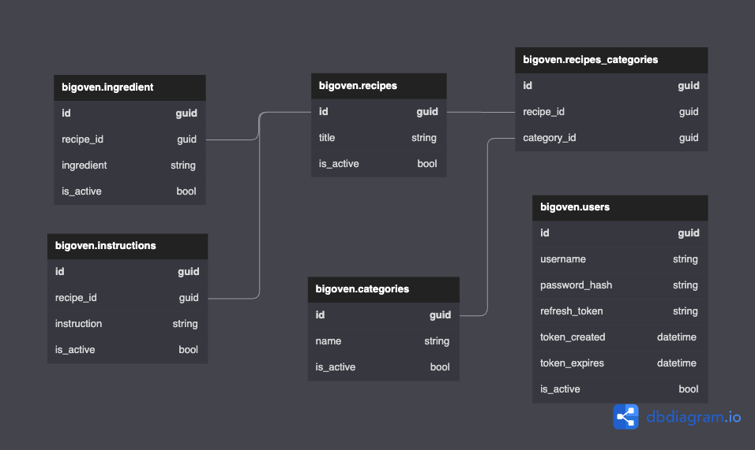

### Code

```
Table bigoven.categories {
  id guid [pk]
  name string [not null]
  is_active bool [default: true]
}

Table bigoven.users {
  id guid [pk]
  username string [not null]
  password_hash string [not null]
  refresh_token string
  token_created datetime
  token_expires datetime
  is_active bool [default: true]
}

Table bigoven.recipes {
  id guid [pk]
  title string [not null]
  is_active bool [default: true]
}

Table bigoven.recipes_categories {
  id guid [pk]
  recipe_id guid
  category_id guid
}
Ref: bigoven.recipes_categories.recipe_id - bigoven.recipes.id
Ref: bigoven.recipes_categories.category_id - bigoven.categories.id
// Ref: bigoven.recipes.id <> bigoven.categories.id

Table bigoven.ingredient {
  id guid [pk]
  recipe_id guid
  ingredient string
  is_active bool [default: true]
}
Ref: bigoven.ingredient.recipe_id - bigoven.recipes.id

Table bigoven.instructions {
  id guid [pk]
  recipe_id guid
  instruction string
  is_active bool [default: true]
}
Ref: bigoven.instructions.recipe_id - bigoven.recipes.id
```

### Schema diagram

